# AEAgenticSupport — Full Agentic Process Document

> **Version:** 1.2 | **Date:** March 2026 | **Codebase:** `d:\AEAgenticSupport`  
> Covers: all agentic scenarios, multi-agent orchestration, RCA agent, DB design, concurrent messages,
> tool failure/restart, restartability assessment, log analysis, and ticket creation.

---

## Table of Contents

1. [Architecture Overview](#1-architecture-overview)
2. [New Database Tables Required](#2-new-database-tables-required)
3. [User Onboarding — First Message](#3-user-onboarding--first-message)
4. [Message → SOP Match → Diagnostic Plan](#4-message--sop-match--diagnostic-plan)
5. [Orchestrator — Agent Availability & Tool Dispatch](#5-orchestrator--agent-availability--tool-dispatch)
6. [Diagnostic Agent — Verification & Plan](#6-diagnostic-agent--verification--plan)
7. [Remediation Agent — Plan & Execution](#7-remediation-agent--plan--execution)
8. [RCA Agent — Root Cause Analysis & RAG Feedback Loop](#8-rca-agent--root-cause-analysis--rag-feedback-loop)
9. [Concurrent Messages — ChatGPT-Style Combining](#9-concurrent-messages--chatgpt-style-combining)
10. [Missing Parameters — User Input Request](#10-missing-parameters--user-input-request)
11. [Agent Offline — Restart Flow](#11-agent-offline--restart-flow)
12. [Ticket Creation Flow](#12-ticket-creation-flow)
13. [Tool Failure — Restart Tool Flow](#13-tool-failure--restart-tool-flow)
14. [Tool Restartability Assessment (Batch/Salary workflows)](#14-tool-restartability-assessment-batchsalary-workflows)
15. [Second Failure → Log Analysis → Human Intervention](#15-second-failure--log-analysis--human-intervention)
16. [Good Response Flow (No Issue Found)](#16-good-response-flow-no-issue-found)
17. [Recurrence & Escalation](#17-recurrence--escalation)
18. [What Already Exists vs What Needs Building](#18-what-already-exists-vs-what-needs-building)
19. [Technical Recommendations](#19-technical-recommendations)

---

## 1. Architecture Overview

```
User (webchat / MS Teams / CogniBOT)
        │
        ▼
  agent_server.py  /  main.py  /  custom/custom_hooks.py
        │  (channel adapters — normalize message, get conversation_id)
        ▼
  gateway/message_gateway.py
        │  (session lock, concurrency gate, intent pre-classification)
        ▼
  agents/orchestrator.py  ←─ MAIN BRAIN
  ┌─────────────────────────────────────────────────────────┐
  │  1. classify_conversational_route (ACK/SMALLTALK/OPS)   │
  │  2. IssueTracker.classify_message (NEW/CONTINUE/RECUR)  │
  │  3. RAG: embed → search SOPs, tools, KB, past incidents  │
  │  4. LLM tool-calling loop (max 15 iterations)           │
  │  5. ApprovalGate (read_only → auto, medium_risk → ask)  │
  │  6. Drain queued concurrent messages                     │
  └─────────────────────────────────────────────────────────┘
        │                          │
        ▼                          ▼
  tools/*.py                state/*.py (PostgreSQL)     agents/*.py
  ├── status_tools.py        ├── conversation_state.py   ├── rca_agent.py
  ├── remediation_tools.py   ├── issue_tracker.py        ├── approval_gate.py
  ├── log_tools.py           ├── agent_catalog.py        └── escalation.py
  ├── notification_tools.py  └── user_memory.py
  └── ae_dynamic_tools.py
        │
        ▼
  AutomationEdge T4 API
  (execute workflow / check agent / poll status)
```

### Key Configuration (`.env` / `config/settings.py`)

| Variable | Purpose |
|----------|---------|
| `AE_BASE_URL` | T4 API base URL |
| `AE_API_KEY` | T4 auth token |
| `POSTGRES_DSN` | PostgreSQL connection string |
| `GOOGLE_CLOUD_PROJECT` | Vertex AI / Gemini project |
| `MAX_AGENT_ITERATIONS` | Max LLM tool-call loop iterations (default 15) |
| `RECURRENCE_ESCALATION_THRESHOLD` | Auto-escalate after N recurrences (default 3) |
| `PROTECTED_WORKFLOWS` | List of workflows that always need human approval |
| `AGENT_STARTUP_PATH` | Path to AE agent startup script for restart |
| `ITSM_WEBHOOK_URL` | *(NEW)* External ITSM endpoint for ticket creation |
| `ITSM_TOKEN` | *(NEW)* Auth token for ITSM webhook |
| `AUTO_TICKET_ON_ESCALATION` | *(NEW)* Auto-create ticket when escalating |

---

## 2. New Database Tables Required

The following tables **do not yet exist** in `setup_db.py` and must be added.

### 2a. `agent_registry` — Store Agents in DB

**Add to `setup_db.py` → `_build_schema_sql()`:**

```sql
-- Agent registry (replaces state/agent_catalog.json for multi-process safety)
CREATE TABLE IF NOT EXISTS agent_registry (
    agent_id            VARCHAR(100) PRIMARY KEY,
    name                VARCHAR(255) NOT NULL,
    description         TEXT,
    usecase             VARCHAR(100),  -- 'diagnostic' | 'remediation' | 'orchestrator'
    status              VARCHAR(50)  DEFAULT 'active',
    -- Status values: active | busy | offline | idle
    persona             VARCHAR(50)  DEFAULT 'technical',
    linked_tools        JSONB        DEFAULT '[]',
    tags                JSONB        DEFAULT '[]',
    is_restartable      BOOLEAN      DEFAULT FALSE,
    startup_path        TEXT,
    created_at          TIMESTAMPTZ  DEFAULT NOW(),
    updated_at          TIMESTAMPTZ  DEFAULT NOW()
);

CREATE INDEX IF NOT EXISTS idx_agent_registry_status
    ON agent_registry(status, usecase);
```

**Seed data to insert after table creation:**

```sql
INSERT INTO agent_registry (agent_id, name, usecase, status, linked_tools) VALUES
('orchestrator_1', 'Ops Orchestrator', 'orchestrator', 'active',
 '["discover_tools","t4_check_agent_status","create_incident_ticket"]'),
('diagnostic_agent_1', 'Diagnostic Agent', 'diagnostic', 'active',
 '["check_workflow_status","list_recent_failures","t4_check_agent_status","get_execution_status","get_execution_logs","get_execution_history"]'),
('remediation_agent_1', 'Remediation Agent', 'remediation', 'active',
 '["trigger_workflow","restart_ae_agent","restart_execution","requeue_item","bulk_retry_failures","create_incident_ticket","send_notification"]')
ON CONFLICT (agent_id) DO NOTHING;
```

### 2b. `tool_restartability` — Safe Restart Assessment

```sql
-- Per-tool/workflow restartability metadata
CREATE TABLE IF NOT EXISTS tool_restartability (
    tool_name               VARCHAR(255) PRIMARY KEY,
    workflow_name           VARCHAR(255),
    is_restartable          BOOLEAN      NOT NULL DEFAULT FALSE,
    supports_checkpoint     BOOLEAN      NOT NULL DEFAULT FALSE,
    idempotent              BOOLEAN      NOT NULL DEFAULT FALSE,
    restart_risk            VARCHAR(50)  DEFAULT 'HIGH',
    duplicate_guard         BOOLEAN      DEFAULT FALSE,
    restart_guidance        TEXT,
    human_approval_required BOOLEAN      DEFAULT TRUE,
    created_at              TIMESTAMPTZ  DEFAULT NOW(),
    updated_at              TIMESTAMPTZ  DEFAULT NOW()
);

-- Seed examples
INSERT INTO tool_restartability VALUES
('payroll_process','PayrollProcess',FALSE,FALSE,FALSE,'HIGH',FALSE,
 'NEVER auto-restart. Records 1-500 may already be processed. Human review required.',TRUE,NOW(),NOW()),
('generate_report','GenerateReport',TRUE,TRUE,TRUE,'LOW',FALSE,
 'Safe to restart. Resumes from last checkpoint page.',FALSE,NOW(),NOW()),
('send_email_notification','SendEmailNotif',TRUE,FALSE,TRUE,'LOW',FALSE,
 'Safe. Email service deduplicates by reference_id.',FALSE,NOW(),NOW())
ON CONFLICT (tool_name) DO NOTHING;
```

### 2c. `agent_execution_status` — Track Which Agent is Free/Busy

```sql
CREATE TABLE IF NOT EXISTS agent_execution_status (
    id               BIGSERIAL    PRIMARY KEY,
    agent_id         VARCHAR(100) REFERENCES agent_registry(agent_id),
    conversation_id  TEXT,
    tool_name        TEXT,
    status           VARCHAR(50)  DEFAULT 'IDLE',
    -- Values: IDLE | BUSY | FAILED | WAITING_INPUT
    started_at       TIMESTAMPTZ  DEFAULT NOW(),
    completed_at     TIMESTAMPTZ,
    error_message    TEXT,
    updated_at       TIMESTAMPTZ  DEFAULT NOW()
);

CREATE INDEX IF NOT EXISTS idx_agent_exec_status
    ON agent_execution_status(agent_id, status);
```

---

## 3. User Onboarding — First Message

```
User → message arrives
        │
        ▼
ConversationState.load(conversation_id)           ← state/conversation_state.py
  → hits PostgreSQL conversation_state table
  → if no row → fresh blank state (phase=IDLE, messages=[])
        │
        ▼
Orchestrator.handle_message(user_message, state)  ← agents/orchestrator.py L53
        │
        ▼
_classify_conversational_route(user_message)       ← L187
  → LLM zero-temp prompt → ACK | SMALLTALK | GENERAL | OPS
        │
        ├── ACK/SMALLTALK → warm greeting
        ├── GENERAL       → answer, offer ops help
        └── OPS           → proceed to Section 4
```

**Improvement:** On first message, query `issue_registry` for past issues of this user:
```python
# After loading state, if state.user_id and no active issues:
past_count = db.count("issue_registry", where={"user_id": state.user_id})
if past_count > 0:
    greeting_prefix = f"Welcome back. You've had {past_count} past issue(s). "
```

---

## 4. Message → SOP Match → Diagnostic Plan

```
OPS message received
        │
        ▼
RAG Engine: rag/engine.py
  rag.embed_query(user_message)                  → embedding vector
  rag.search_sops(user_message, top_k=3)         → SOP documents
  rag.search_tools(user_message, top_k=12)       → tool candidates
  rag.search_kb(user_message, top_k=3)           → KB articles
  rag.search_past_incidents(user_message, top_k=3) → similar past issues
        │
        ▼
IssueTracker.classify_message()                   ← state/issue_tracker.py L198
  → Layer 1: Heuristics (classification_signals.py keywords)
  → Layer 2: Workflow + error signature matching
  → Layer 3: LLM classify → NEW_ISSUE / CONTINUE_EXISTING / RECURRENCE / ...
        │
        ▼
Issue created in issue_registry (PostgreSQL)
issue_id generated: "ISS-{8 hex chars}"
        │
        ▼
_process_message() builds context block:          ← orchestrator.py L459
  context_block = SOPs + KB articles + past incidents
  vertex_tools  = RAG-filtered tools (top 12)
  system_prompt = persona + issue context + tool catalog
        │
        ▼
LLM receives: system_prompt + context_block + user_message + tool_schemas
LLM begins diagnostic plan execution (loop up to 15 iterations)
```

### SOP Fallback (no tool match)

If no tool is called AND SOPs match → `_build_sop_fallback_response()` (orchestrator.py L755):
- Extracts step-by-step guidance from top SOP document
- Returns as human-readable response

---

## 5. Orchestrator — Agent Availability & Tool Dispatch

### Find Free Agent (New — uses `agent_registry` table)

```python
# New file: state/agent_scheduler.py
def find_free_agent(usecase: str) -> dict | None:
    with get_conn() as conn:
        with conn.cursor() as cur:
            cur.execute("""
                SELECT agent_id, name, linked_tools
                FROM agent_registry
                WHERE status = 'active' AND (usecase = %s OR usecase = 'orchestrator')
                ORDER BY updated_at ASC
                LIMIT 1
                FOR UPDATE SKIP LOCKED
            """, (usecase,))
            row = cur.fetchone()
            if row:
                return {"agent_id": row[0], "name": row[1], "linked_tools": row[2]}
    return None

def mark_agent_busy(agent_id: str, conversation_id: str, tool_name: str):
    # INSERT into agent_execution_status + UPDATE agent_registry.status = 'busy'
    ...

def mark_agent_idle(agent_id: str, execution_id: int):
    # UPDATE agent_execution_status.status = 'IDLE', completed_at = NOW()
    # UPDATE agent_registry.status = 'active'
    ...
```

### Tool Dispatch (existing — `tools/registry.py`)

1. `get_vertex_tools_filtered(rag_tool_names, max_rag_tools=12)` — RAG-ranked tools
2. LLM proposes `function_call` → `fn_calls` parsed from response parts
3. `tool_registry.execute(tool_name, **tool_args)` → handler runs
4. Result logged to `tool_execution_log` (PostgreSQL) via `agent_catalog.py._log_to_postgres()`
5. Result fed back as `FunctionResponse` → next LLM iteration

---

## 6. Diagnostic Agent — Verification & Plan

```
find_free_agent("diagnostic") → diagnostic_agent_1
mark_agent_busy(agent_id, conversation_id, "diagnostic_phase")
        │
        ▼
Typical diagnostic tool sequence (LLM decides):
┌──────────────────────────────────────────────────────────────┐
│ Step 1: check_workflow_status(workflow_name)                  │
│    → status, last_execution_status, error_message, agent     │
│                                                              │
│ Step 2: list_recent_failures(hours=24, limit=20)             │
│    → list of execution_id + workflow_name + error_message    │
│                                                              │
│ Step 3: t4_check_agent_status(agent_name)                    │
│    → agent_state: CONNECTED | DISCONNECTED | UNKNOWN         │
│    → is_healthy: bool                                        │
│                                                              │
│ Step 4: get_execution_logs(execution_id, tail=200)           │
│    → step-by-step trace + error lines                        │
│                                                              │
│ Step 5 (if needed): get_execution_history(workflow_name, 10) │
│    → pattern detection (once/recurring?)                     │
└──────────────────────────────────────────────────────────────┘
        │
        ▼
After each tool result → orchestrator enriches the Issue:
  tracker.add_workflow_to_issue(issue_id, workflow_name)
  tracker.add_error_signature(issue_id, error_msg[:100])
  tracker.add_finding_to_issue(issue_id, {category, summary, severity})
        │
        ▼
mark_agent_idle(agent_id, execution_id)
        │
        ▼
Result → passes back to Orchestrator
  → Issue found?  YES → Section 7 (Remediation)
  → Issue found?  NO  → Section 15 (Good Response)
```

---

## 7. Remediation Agent — Plan & Execution

```
find_free_agent("remediation") → remediation_agent_1
mark_agent_busy(...)
        │
        ▼
LLM builds remediation plan from diagnostic findings:

Example — "workflow failed because agent is offline":
┌──────────────────────────────────────────────────────────────┐
│ Step 1: t4_check_agent_status() → confirm DISCONNECTED       │
│ Step 2: restart_ae_agent(agent_name)                         │
│    → ApprovalGate: tier=medium_risk → ask user YES/NO        │
│    → On approval: subprocess.run(startup_cmd, timeout=10)    │
│    → Poll t4_check_agent_status() every 2s × 15 attempts     │
│ Step 3: check_workflow_status(workflow_name) → verify fixed  │
│ Step 4: trigger_workflow(workflow_name, params)               │
│    → execute the failed workflow again                       │
│    → poll execution status until Complete / Failure          │
└──────────────────────────────────────────────────────────────┘
        │
        ├── Success → tracker.resolve_issue(issue_id, resolution_text)
        │             mark_agent_idle()
        │             → Section 8 (RCA Agent triggered)
        │
        └── Failure → Section 13 (Tool Failure → Restart Tool)
```

### Approval Gate Tiers (`agents/approval_gate.py`)

| Tier | Tools | Action |
|------|-------|--------|
| `read_only` | check_workflow_status, t4_check_agent_status, get_execution_logs | ✅ Auto-run |
| `low_risk` | restart_execution, requeue_item | ✅ Auto-run |
| `medium_risk` | trigger_workflow, restart_ae_agent | ⏸ Ask user: "yes/no" |
| `high_risk` | bulk_retry_failures, disable_workflow | ⏸ Ask user + reason |

**PROTECTED_WORKFLOWS** (in `.env`) → always require approval regardless of tier.

---

## 8. RCA Agent — Root Cause Analysis & RAG Feedback Loop

**File:** `agents/rca_agent.py` | **Class:** `RCAAgent`

### When RCA is Triggered

| Trigger | Who calls it | Method |
|---------|-------------|--------|
| Issue successfully resolved | Orchestrator (after `resolve_issue`) | `rca_agent.generate_rca(state, tracker=tracker, issue_id=issue_id)` |
| User explicitly asks | User: *"Give me an RCA"* / *"What caused this?"* | Same method |
| Issue escalated | After escalation actions | Included in escalation summary |

### Full RCA Flow

```
Issue resolved (or user asks for RCA)
        │
        ▼
RCAAgent.generate_rca(state, incident_summary, tracker, issue_id)
        │                                                ← rca_agent.py L20
        ▼
Gather inputs:
  findings  = tracker.get_issue_findings(issue_id)      ← structured findings list
  affected  = issue.workflows_involved                   ← workflow names
  tool_logs = state.tool_call_log[-15:]                  ← last 15 tool calls
        │
        ▼
RAG search for similar past incidents:
  rag.search_past_incidents(affected_workflows, top_k=3) ← rag/engine.py
  → returns: summary, root_cause, resolution of 3 closest past incidents
        │
        ▼
Persona check: state.user_role
        │
        ├── "business"  → _generate_business_rca()       ← rca_agent.py L79
        │     LLM prompt covers:
        │       1. What happened (plain English, no jargon)
        │       2. Business impact (delays, affected processes)
        │       3. Why it happened (simplified)
        │       4. What was done to fix it
        │       5. How to prevent recurrence
        │     System: "You write non-technical RCA for business stakeholders"
        │     Output: clean report ≤ 500 words
        │
        └── "technical" → _generate_technical_rca()      ← rca_agent.py L106
              LLM prompt covers:
                1. Incident Summary
                2. Timeline of events (derived from tool call log)
                3. Root Cause Chain (A → B → C)
                4. Impact Analysis (workflows, dependencies, data pipelines)
                5. Resolution Steps Taken
                6. Corrective Actions / Prevention
                7. Recommendations
              Includes: workflow names, execution IDs, timestamps, error strings
        │
        ▼
state.rca_data saved:
  {"generated_at": ISO timestamp, "report": rca_text, "user_role": role}
        │
        ▼
_index_as_past_incident(state, rca_report)              ← rca_agent.py L136
  → RAG FEEDBACK LOOP:
    1. incident_id = "INC-AUTO-{conversation_id}"
    2. root_cause_prompt → LLM extracts root cause in 1 sentence
    3. rag.index_past_incident(
         incident_id, summary, root_cause, resolution[:500],
         workflows_involved, category="auto_resolved"
       )
  → Future searches (search_past_incidents) will FIND THIS incident
  → Each resolved issue improves future diagnostics automatically
```

### Business vs Technical RCA Output Comparison

| Aspect | Business RCA | Technical RCA |
|--------|-------------|---------------|
| Audience | Managers, business users | Ops engineers, developers |
| Language | Plain English | Technical with IDs, codes |
| Contains | Impact, business terms | Workflow names, execution IDs, stack traces |
| Length | ≤ 500 words | As detailed as needed |
| Tool logs | ❌ Hidden | ✅ Last 15 tool calls included |
| Error codes | ❌ Hidden | ✅ Shown with context |

### RCA Invocation in Orchestrator

```python
# In agents/orchestrator.py — after resolve_issue() on successful remediation:
from agents.rca_agent import RCAAgent
rca_agent = RCAAgent()

# Auto-generate and index RCA silently (no output to user unless asked)
rca_report = rca_agent.generate_rca(
    state=state,
    incident_summary=active_issue.description,
    tracker=tracker,
    issue_id=active_issue.issue_id
)
# RCA is now indexed in RAG — ready to surface in future similar incidents

# If user explicitly asked for RCA:
if user_explicitly_requested_rca:
    return rca_report  # Return full report to user
else:
    return resolution_summary  # Just the resolution message
```

### RAG Feedback Loop Diagram

```
Incident A resolved ─────────────────────────────────────────────────┐
        │                                                            │
        ▼                                                            │
RCAAgent._index_as_past_incident()                                   │
  → stored in rag_documents (collection="past_incidents")            │
        │                                                            │
        ▼                                                            │
Incident B occurs (same workflow) ───────────────────────────────────┘
  rag.search_past_incidents(query) ← Finds Incident A
  LLM context contains:
    "Past: PayrollWorkflow failed — Root Cause: X — Resolution: Y"
  → LLM skips redundant diagnostic steps
  → Proposes known fix immediately
  → Faster resolution time on recurrence
```

---

## 9. Concurrent Messages — ChatGPT-Style Combining

**Scenario:** User sends "my report not received today" → agent starts processing →
user sends "also yesterday's report not received" mid-process.

### Layer 1: `gateway/message_gateway.py` (existing)

```python
# When agent is already working:
if state.is_agent_working:
    # Classify new message intent
    intent = _classify_message_intent(new_message)
    # ADDITIVE → queue it for combining
    # INTERRUPT → set interrupt_requested flag  
    # CANCEL    → set interrupt_requested + reset
    # APPROVAL  → pass to approval handler immediately
    if intent == "ADDITIVE":
        state.queue_user_message(new_message, hint="combined_issue")
        return jsonify({"status": "queued", "message": "Message queued and will be combined."})
```

### Layer 2: `state/conversation_state.py` (existing)

```python
# Thread-safe queue already implemented:
def queue_user_message(self, message: str, hint: str = ""):
    with self._queue_lock:
        self._message_queue.append({"content": message, "hint": hint, ...})
```

### Layer 3: Drain after main processing (existing — `orchestrator.py` `_drain_queued_messages()`)

After investigation completes:
```python
queued = self._drain_queued_messages(state, tracker)
if queued:
    # Combined context re-classified
    # Both "today report not received" + "yesterday report not received"
    # → IssueTracker classifies queued msg as CONTINUE_EXISTING | ISS-xxxx
    # → Issue description enriched with both time ranges
    # → Diagnostic re-runs with expanded scope
    final_response += "\n\n" + queued
```

**Result:** Single combined investigation output covering both messages. Issue object updated with full scope.

---

## 10. Missing Parameters — User Input Request


**Scenario:** LLM decides to run `trigger_workflow("PayrollProcess", params={})` but
required params `employee_id` and `pay_period` are missing.

### "Ask Again" Pattern (existing in `tools/remediation_tools.py` L249 + `registry.py` L282)

```python
# Tool returns:
{
  "success": False,
  "needs_user_input": True,
  "missing_params": ["employee_id", "pay_period"],
  "question": "I'm ready to help with Payroll Process! Just need:\n  • employee_id\n  • pay_period",
  "workflow_name": "PayrollProcess",
  "tool_name": "trigger_workflow"
}
```

### Orchestrator handles this (orchestrator.py L703):

```python
if result.data.get("needs_user_input"):
    # Store in state.param_collection (persisted to PostgreSQL)
    self._start_or_update_param_collection(
        state, workflow_name, missing_params, tool_name, tool_args
    )
    # Return question to user — SUSPENDED
    return question_message

# On next user message:
_continue_param_collection(user_message, state, tracker)
  → parse user reply for param values
  → state.param_collection["collected"] = {"employee_id": "EMP001", ...}
  → if all collected → re-run original tool with complete params
```

### `state.param_collection` structure (persisted in `conversation_state.state_data`):

```json
{
  "workflow_name": "PayrollProcess",
  "missing_params": ["employee_id", "pay_period"],
  "collected": {"employee_id": "EMP001"},
  "tool_name": "trigger_workflow",
  "tool_args": {"workflow_name": "PayrollProcess"},
  "auto_execute": true
}
```

---

## 11. Agent Offline — Restart Flow

```
User: "Is the agent running?" OR workflow stuck → agent offline detected
        │
        ▼
_classify_agent_action(user_message)              ← orchestrator.py L285
  → LLM returns: STATUS | RESTART | NONE
        │
        ▼
_handle_agent_status_request()                    ← orchestrator.py L347
  → tool: t4_check_agent_status(agent_name)
  → result: agent_state = "DISCONNECTED", is_healthy = False
        │
        ▼
if not healthy AND AGENT_STARTUP_PATH configured:
  → state.pending_action = {tool: "restart_ae_agent", tier: "medium_risk"}
  → state.phase = AWAITING_APPROVAL
  → response: "Agent [name] is DISCONNECTED. Restart it? (yes/no)"
        │
        ▼
User: "yes"
  → _handle_approval_response()                   ← orchestrator.py L69
  → restart_ae_agent(agent_name)                  ← remediation_tools.py L92
      1. _resolve_agent_startup_cmd() → finds startup.bat / aeagent.exe
      2. subprocess.run(cmd, timeout=10)
      3. Poll t4_check_agent_status every 2s × 15 attempts
      4. If healthy → return: "Agent is now RUNNING"
      5. If still down → attach log_tail → Section 14
```

### Agent Name Resolution Order:

1. LLM extracts `agent_name` from user message
2. `state.last_agent_name` (last remembered in session)
3. `user_memory.get_last_agent_name(user_id)` from `user_memory.json`
4. Prompt user: "Which agent should I restart?"

---

## 12. Ticket Creation Flow

**`create_incident_ticket` already exists** in `tools/notification_tools.py` (line 34).

### Auto-Trigger Ticket in These Cases:

| Trigger | When | Tool Call |
|---------|------|-----------|
| Escalation | recurrence_count ≥ RECURRENCE_ESCALATION_THRESHOLD | `create_incident_ticket(priority="P1")` |
| Tool fails twice | restart also failed | `create_incident_ticket(priority="P2")` |
| Human intervention | log analysis says manual fix needed | `create_incident_ticket(priority="P2")` |
| User requests | "create a ticket" | `create_incident_ticket(priority="P3")` |

### Add Auto-Ticket on Escalation (orchestrator.py L126 — extend existing code):

```python
if tracker.should_escalate_recurrence(old_issue.issue_id):
    old_issue.status = IssueStatus.ESCALATED
    # Auto-create ticket
    ticket = tool_registry.execute("create_incident_ticket",
        title=f"[ESCALATED] {old_issue.title} — Recurrence #{old_issue.recurrence_count}",
        description=old_issue.description + "\n\nWorkflows: " + ", ".join(old_issue.workflows_involved),
        priority="P1",
        assignee_group=CONFIG.get("ESCALATION_TEAM", "ops-l2")
    )
    ticket_id = (ticket.data or {}).get("ticket_id", "N/A")
    response = f"This issue has recurred {old_issue.recurrence_count} times. Escalated. Ticket: {ticket_id}"
```

### Ticket Response (`notification_tools.py` existing behavior):

- Tries `/api/v1/incidents`, `/{org}/incidents`, `/incidents` endpoints
- Falls back to `LOCAL-{timestamp}` reference if ITSM API is unreachable
- Returns: `{success, ticket_id, title, priority, status}`

---

## 13. Tool Failure — Restart Tool Flow

**Scenario:** Tool (RPA workflow) fails due to server error. Retry using same request context.

### New Function: `restart_tool_execution()` (add to `tools/remediation_tools.py`)

```python
def restart_tool_execution(
    original_request_id: str,
    tool_name: str,
    original_params: dict
) -> dict:
    """
    Retry a failed tool using its original request_id context.
    Checks restartability first (Section 13).
    """
    # 1. Check restartability
    meta = get_tool_restartability(tool_name)
    if not meta["is_restartable"]:
        return {
            "success": False,
            "restartable": False,
            "reason": meta["reason"],
            "recommendation": "Human review required before restart."
        }

    client = get_ae_client()
    try:
        if meta["supports_checkpoint"] and original_request_id:
            # Resume from last successful checkpoint
            resp = client.post(
                f"/workflowinstances/{original_request_id}/restart",
                payload={"fromCheckpoint": True, "params": original_params}
            )
        else:
            # Full restart with same params (safe because idempotent=True)
            resp = client.execute_workflow(
                workflow_name=original_params.get("workflow_name"),
                params={k: v for k, v in original_params.items() if k != "workflow_name"},
                source="restart-tool-recovery"
            )
        new_id = resp.get("automationRequestId") or resp.get("requestId")
        return {"success": True, "new_request_id": new_id,
                "restarted_from": "checkpoint" if meta["supports_checkpoint"] else "beginning"}
    except Exception as e:
        return {"success": False, "error": str(e)}
```

### Register in tool_registry:

```python
tool_registry.register(
    ToolDefinition(
        name="restart_tool_execution",
        description="Retry a failed workflow execution using its original request ID. Checks restartability before attempting.",
        category="remediation",
        tier="medium_risk",
        parameters={
            "original_request_id": {"type": "string", "description": "The failed execution's request ID"},
            "tool_name": {"type": "string", "description": "Tool/workflow that failed"},
            "original_params": {"type": "object", "description": "Original tool parameters"},
        },
        required_params=["tool_name", "original_params"],
    ),
    restart_tool_execution,
)
```

### Wiring in `orchestrator.py` (after tool failure in main loop):

```python
if not result.success:
    request_id = (result.data or {}).get("requestId") or (result.data or {}).get("automationRequestId")
    restart = tool_registry.execute("restart_tool_execution",
        original_request_id=request_id or "",
        tool_name=tool_name,
        original_params=tool_args
    )
    if restart.success and restart.data.get("success"):
        # Continue polling new_request_id
        pass
    else:
        # Not restartable or failed again → Section 14
        pass
```

---

## 14. Tool Restartability Assessment (Batch/Salary Workflows)

> **Critical:** Salary workflow processes 1000 records. Fails at record 500.
> If restarted from beginning → records 1–500 are duplicated.

### Decision Tree

```
Tool FAILS
    │
    ▼
get_tool_restartability(tool_name)
    │
    ├── Source 1: tool_restartability PostgreSQL table (highest priority)
    ├── Source 2: workflow_catalog.raw_data["restartable"] metadata
    └── Source 3: Default = {is_restartable: FALSE, human_approval_required: TRUE}
    │
    ▼
is_restartable = FALSE?
    ├── human_approval_required = TRUE
    │   → ASK USER:
    │   "⚠️ PayrollProcess is a sensitive batch workflow.
    │    Records 1–500 may already be processed.
    │    Please verify manually, then confirm to restart."
    │   → On confirmation → restart with explicit approval
    │
    └── restart_risk = HIGH
        → create ticket + escalate (no auto-action)

is_restartable = TRUE?
    ├── supports_checkpoint = TRUE
    │   → restart from checkpoint (record 500 onwards) — no duplicates
    │   → approval tier: low_risk (auto)
    │
    └── idempotent = TRUE (no checkpoint, but safe to restart)
        → full restart is safe
        → approval tier: low_risk (auto)
```

### New Function: `get_tool_restartability()` (add to `tools/remediation_tools.py`)

```python
def get_tool_restartability(tool_name: str) -> dict:
    # 1: Check tool_restartability table
    try:
        with get_conn() as conn:
            with conn.cursor() as cur:
                cur.execute("""
                    SELECT is_restartable, supports_checkpoint, idempotent,
                           restart_risk, duplicate_guard, restart_guidance,
                           human_approval_required
                    FROM tool_restartability
                    WHERE tool_name = %s OR workflow_name = %s LIMIT 1
                """, (tool_name, tool_name))
                row = cur.fetchone()
                if row:
                    return {
                        "is_restartable": row[0], "supports_checkpoint": row[1],
                        "idempotent": row[2], "restart_risk": row[3],
                        "duplicate_guard": row[4], "reason": row[5],
                        "human_approval_required": row[6], "source": "db"
                    }
    except Exception as e:
        logger.warning("tool_restartability lookup failed: %s", e)

    # 2: Check workflow_catalog metadata
    try:
        with get_conn() as conn:
            with conn.cursor() as cur:
                cur.execute("SELECT raw_data FROM workflow_catalog WHERE workflow_name = %s LIMIT 1", (tool_name,))
                row = cur.fetchone()
                if row and row[0]:
                    meta = row[0]
                    return {
                        "is_restartable": meta.get("restartable", False),
                        "supports_checkpoint": meta.get("checkpoint", False),
                        "idempotent": meta.get("idempotent", False),
                        "restart_risk": meta.get("restart_risk", "UNKNOWN"),
                        "reason": meta.get("restart_note", "No guidance in catalog."),
                        "human_approval_required": True, "source": "workflow_catalog"
                    }
    except Exception:
        pass

    # 3: Safe default
    return {
        "is_restartable": False, "supports_checkpoint": False, "idempotent": False,
        "restart_risk": "UNKNOWN", "human_approval_required": True,
        "reason": "No restartability metadata found. Defaulting to NOT restartable.",
        "source": "default"
    }
```

---

## 15. Second Failure → Log Analysis → Human Intervention

**Scenario:** Tool fails → restart attempted (Section 12) → restart also fails.

```
First failure → restart_tool_execution() → FAILED AGAIN
        │
        ▼
Read agent logs:
_collect_agent_log_tail(max_lines=200)            ← remediation_tools.py L78
  → reads: aeagent.log, health.log, catalina.log
  → tails last 200 lines from AGENT_STARTUP_PATH/../logs/

Also read workflow execution logs:
get_execution_logs(execution_id, tail=200)         ← log_tools.py L13
  → T4 API execution trace
        │
        ▼
analyze_logs_and_plan(log_lines, context)          ← NEW — add to log_tools.py
  → LLM prompt: analyze logs, find root cause,
                list automated and manual steps
  → returns: {root_cause, automated_steps, human_required, human_steps, confidence}
        │
        ├── human_required = FALSE + automated_steps exist
        │   → Execute automated steps via tool calls
        │   → Retry original operation
        │
        └── human_required = TRUE
            → create_incident_ticket(priority="P2", description=findings + log_excerpt)
            → Response to user:
              "⚠️ Manual intervention required.
               Root cause: [root_cause]
               
               Please follow these steps:
               1. [human_steps[0]]
               2. [human_steps[1]]
               ...
               
               Ticket #{ticket_id} has been created for the operations team."
```

### New Function: `analyze_logs_and_plan()` (add to `tools/log_tools.py`)

```python
def analyze_logs_and_plan(log_lines: list[str], context: str = "", max_lines: int = 200) -> dict:
    """LLM-powered log analysis to produce a structured remediation plan."""
    from config.llm_client import llm_client
    log_text = "\n".join(log_lines[-max_lines:])
    prompt = f"""Analyze these agent/workflow logs and provide a remediation plan.
Context: {context}

Log tail ({max_lines} lines):
{log_text}

Respond as JSON only:
{{
  "root_cause": "single sentence",
  "automated_steps": ["step1", "step2"],
  "human_required": true or false,
  "human_steps": ["step1", "step2"],
  "confidence": "HIGH|MEDIUM|LOW"
}}"""
    try:
        import json
        raw = llm_client.chat(prompt, temperature=0.1, max_tokens=800)
        # Strip markdown code blocks if present
        raw = raw.strip().lstrip("```json").lstrip("```").rstrip("```").strip()
        return json.loads(raw)
    except Exception as e:
        logger.warning("analyze_logs_and_plan LLM failed: %s", e)
        return {
            "root_cause": "Unable to parse logs automatically.",
            "automated_steps": [],
            "human_required": True,
            "human_steps": ["Review agent logs manually", "Contact administrator"],
            "confidence": "LOW"
        }
```

---

## 16. Good Response Flow (No Issue Found)

```
Diagnostic tools complete
  → check_workflow_status → COMPLETE
  → list_recent_failures → 0 failures in 24h
  → t4_check_agent_status → CONNECTED
        │
        ▼
LLM determines: no actionable issue found
        │
        ▼
_should_use_sop_fallback(tool_hits, sop_hits) check    ← orchestrator.py L754
  → if tool similarity low AND sop_hits found → SOP-guided response
        │
        ▼
Response:
  "✅ Everything looks healthy!
   
   I checked:
   • Workflow status: COMPLETE (last run: 2h ago)
   • Agent: CONNECTED
   • No failures in the last 24 hours

   If you're still experiencing this, here are recommended steps:
   [SOP guidance steps]
   
   Would you like a deeper check or a specific time range?"
```

---

## 17. Recurrence & Escalation

### Recurrence Detection (`state/issue_tracker.py`)

1. `_check_recurrence(message)` → matches against `resolved_issues` by workflow name + failure keywords
2. Match → `MessageClassification.RECURRENCE` → `tracker.reopen_issue(issue_id)`
3. `issue.recurrence_count += 1`, `issue.status = ACTIVE`
4. `should_escalate_recurrence()` → `True` if `recurrence_count >= RECURRENCE_ESCALATION_THRESHOLD (3)`

### Escalation Actions (extend `orchestrator.py` L126)

```python
if tracker.should_escalate_recurrence(old_issue.issue_id):
    old_issue.status = IssueStatus.ESCALATED
    # 1. Create ticket automatically
    ticket = tool_registry.execute("create_incident_ticket",
        title=f"[ESCALATED] {old_issue.title}",
        description=old_issue.description + "\nError signatures: " + str(old_issue.error_signatures),
        priority="P1"
    )
    ticket_id = (ticket.data or {}).get("ticket_id", "N/A")
    # 2. Notify L2 team
    tool_registry.execute("send_notification",
        channel="teams",
        recipients=CONFIG.get("L2_TEAM_CONTACTS", []),
        subject=f"Issue Escalated: {old_issue.title}",
        message=f"Recurring issue escalated. Ticket: {ticket_id}."
    )
    return f"This issue has recurred {old_issue.recurrence_count} times. Escalated. Ticket: {ticket_id}."
```

---

## 18. What Already Exists vs What Needs Building

| Feature | Status | Notes |
|---------|--------|-------|
| Orchestrator + LLM tool loop | ✅ Exists | `agents/orchestrator.py` |
| Issue tracking (PostgreSQL) | ✅ Exists | `state/issue_tracker.py` + `issue_registry` table |
| Concurrent message queue | ✅ Exists | `conversation_state._message_queue` + `_drain_queued_messages` |
| Agent status check | ✅ Exists | `t4_check_agent_status_tool()` in `status_tools.py` |
| Agent restart | ✅ Exists | `restart_ae_agent()` in `remediation_tools.py` |
| Approval gate | ✅ Exists | `agents/approval_gate.py` |
| Log file tail (200 lines) | ✅ Exists | `_collect_agent_log_tail()` in `remediation_tools.py` |
| Workflow execution logs | ✅ Exists | `get_execution_logs()` in `log_tools.py` |
| Ticket creation | ✅ Exists | `create_incident_ticket()` in `notification_tools.py` |
| SOP fallback response | ✅ Exists | `_build_sop_fallback_response()` in `orchestrator.py` |
| **RCA Agent** | ✅ Exists | `agents/rca_agent.py` — `RCAAgent.generate_rca()` |
| **RCA RAG indexing** | ✅ Exists | `_index_as_past_incident()` → `rag.index_past_incident()` |
| **RCA auto-invocation after resolve** | ❌ Not wired | Call `rca_agent.generate_rca()` in orchestrator after `resolve_issue()` |
| **Agent registry table (DB)** | ❌ Missing | Add to `setup_db.py` (Section 2a) |
| **Tool restartability table** | ❌ Missing | Add to `setup_db.py` (Section 2b) |
| **Agent execution status table** | ❌ Missing | Add to `setup_db.py` (Section 2c) |
| **`find_free_agent()` scheduler** | ❌ Missing | New `state/agent_scheduler.py` |
| **`restart_tool_execution()`** | ❌ Missing | Add to `remediation_tools.py` (Section 12) |
| **`get_tool_restartability()`** | ❌ Missing | Add to `remediation_tools.py` (Section 13) |
| **`analyze_logs_and_plan()`** | ❌ Missing | Add to `log_tools.py` (Section 14) |
| **Auto-ticket on escalation** | ❌ Missing | Extend `orchestrator.py` L126 (Section 16) |
| **Multi-agent phase separation** | ❌ Missing | Use `agent_scheduler.py` in `_process_message()` |

---

## 19. Technical Recommendations

### Priority 1 (Critical — Add Tables Now)
Run this in `setup_db.py` → add DDL for `agent_registry`, `tool_restartability`, `agent_execution_status` (Section 2).

### Priority 2 (High — New Functions)
Add to `tools/remediation_tools.py`:
- `get_tool_restartability(tool_name)` — Section 13
- `restart_tool_execution(request_id, tool_name, params)` — Section 12

Add to `tools/log_tools.py`:
- `analyze_logs_and_plan(log_lines, context)` — Section 14

### Priority 3 (High — Auto Ticket on Escalation)
Extend `orchestrator.py` line 126 to call `create_incident_ticket` automatically when escalating (Section 16). `create_incident_ticket` already exists in `notification_tools.py`.

### Priority 4 (Medium — Multi-Agent Scheduling)
Create `state/agent_scheduler.py` with `find_free_agent()`, `mark_agent_busy()`, `mark_agent_idle()`. Wire into `_process_message()` to properly separate diagnostic and remediation phases.

### Priority 5 (Nice-to-have — Real-Time Streaming)
`gateway/progress.py` `ProgressCallback` already exists. Implement WebSocket push to show users step-by-step progress like:
```
[10:15:01] 🔍 Checking workflow status...
[10:15:03] ✅ Agent: CONNECTED  
[10:15:05] ⚠️ Workflow failed at 10:10:00
[10:15:07] 📋 Proposing remediation...
[10:15:08] ⏳ Awaiting your approval...
```

---

## Full Flow Mermaid Diagram

```mermaid
flowchart TD
    A[User sends message] --> B{First message?}
    B -- Yes --> C[ConversationState.load - fresh state]
    B -- No  --> D[ConversationState.load - from PostgreSQL DB]
    C & D --> GW[gateway/message_gateway.py]

    GW --> BusyCheck{is_agent_working?}
    BusyCheck -- YES --> IntentQ{Message intent?}
    IntentQ -- ADDITIVE --> Queue[queue_user_message to _message_queue]
    IntentQ -- CANCEL_INTERRUPT --> Interrupt[Set interrupt_requested flag]
    IntentQ -- APPROVAL --> ApprCheck[_handle_approval_response]
    BusyCheck -- NO --> E[classify_conversational_route - LLM]

    E -- ACK_SMALLTALK --> F[Warm greeting response]
    E -- GENERAL --> F2[Answer and offer ops help]
    E -- OPS --> G[RAG Engine - rag/engine.py]

    G --> G2[search SOPs top 3]
    G --> G3[search tools top 12]
    G --> G4[search KB top 3]
    G --> G5[search past_incidents top 3]
    G2 & G3 & G4 & G5 --> H[IssueTracker.classify_message]

    H -- NEW_ISSUE --> I[create_issue in issue_registry]
    H -- CONTINUE_EXISTING --> I2[Enrich existing issue]
    H -- FOLLOWUP --> I2
    H -- RECURRENCE --> REC{recurrence_count >= 3?}
    REC -- YES --> ESC[IssueStatus = ESCALATED]
    ESC --> ESC2[create_incident_ticket P1]
    ESC2 --> ESC3[send_notification to L2 team]
    ESC3 --> RCAESC[RCAAgent.generate_rca - escalation RCA]
    RCAESC --> FINAL[Final response to user]
    REC -- NO --> I3[reopen_issue - increment recurrence_count]
    I3 --> I

    I & I2 --> AWAITCHECK{phase = AWAITING_APPROVAL?}
    AWAITCHECK -- YES --> ApprCheck
    AWAITCHECK -- NO --> PARAMCHECK{param_collection active?}
    PARAMCHECK -- YES --> CP[_continue_param_collection]
    CP --> CPALL{All params collected?}
    CPALL -- YES --> RETOOL[Re-run original tool with complete params]
    CPALL -- NO --> ASKMORE[Ask user for remaining params]
    PARAMCHECK -- NO --> DA[find_free_agent usecase=diagnostic]

    DA --> DB[mark_agent_busy in agent_execution_status]
    DB --> DC[LLM selects diagnostic tools]
    DC --> DC1[check_workflow_status]
    DC --> DC2[list_recent_failures hours=24]
    DC --> DC3[t4_check_agent_status]
    DC --> DC4[get_execution_logs tail=200]
    DC --> DC5[get_execution_history]
    DC1 & DC2 & DC3 & DC4 & DC5 --> DD[add_finding and add_error_signature to Issue object]
    DD --> DE[mark_agent_idle]
    DE --> DF{Issue found?}

    DF -- NO --> GOOD1{SOP hits available?}
    GOOD1 -- YES --> GOOD2[_build_sop_fallback_response - SOP steps to user]
    GOOD1 -- NO --> GOOD3[Health confirmed - all clear response]

    DF -- YES --> AGOFF{Agent DISCONNECTED?}
    AGOFF -- YES --> AGOFF2[pending_action = restart_ae_agent tier medium_risk]
    AGOFF2 --> AGAPP[AWAITING_APPROVAL - Restart agent? yes or no]
    AGAPP -- YES --> AGOFF4[restart_ae_agent - subprocess run startup cmd]
    AGOFF4 --> AGOFF5[Poll t4_check_agent_status every 2s up to 15 times]
    AGOFF5 --> AGOFF6{Agent running?}
    AGOFF6 -- YES --> RA
    AGOFF6 -- NO --> LOGREAD
    AGAPP -- Rejected --> RJ[Cancel action and inform user]
    AGOFF -- NO --> RA

    RA[find_free_agent usecase=remediation]
    RA --> RB[mark_agent_busy]
    RB --> RC[LLM builds remediation plan from issue findings]
    RC --> RD{Missing tool params?}
    RD -- YES --> RD2[needs_user_input with missing_params list]
    RD2 --> RD3[_start_or_update_param_collection in state]
    RD3 --> ASKMORE
    RD -- NO --> RE{ApprovalGate.needs_approval?}

    RE -- NO --> RF[Execute tool via tool_registry.execute]
    RE -- YES --> RG[format_approval_prompt - ask user]
    RG --> ApprCheck
    ApprCheck --> RH{classify_approval_turn result}
    RH -- APPROVE --> RF
    RH -- REJECT_CANCEL --> RJ
    RH -- CLARIFY --> RK[format_clarification_prompt]
    RH -- NEW_REQUEST --> E
    RF --> RS{Tool success?}

    RS -- YES --> RESOLVE[tracker.resolve_issue with resolution_text]
    RESOLVE --> RCA1[RCAAgent.generate_rca - rca_agent.py L20]
    RCA1 --> RCA2[Gather: findings + workflows_involved + tool_call_log last 15]
    RCA2 --> RCA3[rag.search_past_incidents top 3 similar cases]
    RCA3 --> RCA4{state.user_role?}

    RCA4 -- business --> BIZ1[_generate_business_rca - rca_agent.py L79]
    BIZ1 --> BIZ2[Plain English - no jargon - max 500 words]
    BIZ2 --> BIZ3[Covers: what happened + business impact + why + fix + prevention]

    RCA4 -- technical --> TECH1[_generate_technical_rca - rca_agent.py L106]
    TECH1 --> TECH2[Timeline + root cause chain A to B to C + IDs + tool logs]
    TECH2 --> TECH3[Includes: workflow names + execution IDs + error strings]

    BIZ3 & TECH3 --> RCASAVE[state.rca_data saved - generated_at + report + user_role]
    RCASAVE --> RCAIDX[_index_as_past_incident - rca_agent.py L136]
    RCAIDX --> RCAEXT[LLM extracts root_cause in one sentence]
    RCAEXT --> RCASTORE[rag.index_past_incident stored in collection=past_incidents]
    RCASTORE --> RCALOOP[RAG Feedback Loop - future similar incidents surface this resolution]
    RCALOOP --> FINAL

    RS -- NO --> FAIL1[First tool failure]
    FAIL1 --> RESTCHECK[get_tool_restartability]
    RESTCHECK --> RESTDB[Check tool_restartability PostgreSQL table]
    RESTDB --> RESTCAT[Check workflow_catalog.raw_data restartable field]
    RESTCAT --> RESTDEF[Default: not restartable if no metadata found]
    RESTDEF --> RESTQ{is_restartable?}

    RESTQ -- YES_checkpoint --> CHKPT[restart_tool_execution fromCheckpoint=True]
    CHKPT --> CHKPT2{Restart success?}
    CHKPT2 -- YES --> RESOLVE
    CHKPT2 -- NO --> LOGREAD

    RESTQ -- YES_idempotent --> FULLRS[restart_tool_execution full restart]
    FULLRS --> FULLRS2{Restart success?}
    FULLRS2 -- YES --> RESOLVE
    FULLRS2 -- NO --> LOGREAD

    RESTQ -- NO --> HUMANQ{human_approval_required?}
    HUMANQ -- YES --> HUMANASK[Ask user to verify records manually then confirm]
    HUMANASK -- Confirmed --> MANUALRS[Manual restart with explicit user approval]
    MANUALRS --> RS
    HUMANASK -- Declined --> LOGREAD
    HUMANQ -- HIGH --> LOGREAD

    LOGREAD[_collect_agent_log_tail 200 lines + get_execution_logs tail=200]
    LOGREAD --> LOGANALYZ[analyze_logs_and_plan - LLM reads log tail]
    LOGANALYZ --> LOGQ{human_required?}
    LOGQ -- NO --> AUTOFIX[Execute automated fix steps via tool calls]
    AUTOFIX --> RETOOL
    LOGQ -- YES --> TICKET2[create_incident_ticket priority P2]
    TICKET2 --> HUMANSTEPS[Human remediation steps response to user]

    Queue --> Drain[_drain_queued_messages after current processing completes]
    Drain --> Combine[IssueTracker.classify_message on queued message]
    Combine -- CONTINUE_EXISTING --> DD
    Combine -- NEW_ISSUE --> I

    RETOOL --> RF
```



---

*Document version 1.2 | March 2026 | Codebase: d:\AEAgenticSupport*
*All file paths, function names, line numbers, and table names verified against actual codebase.*
